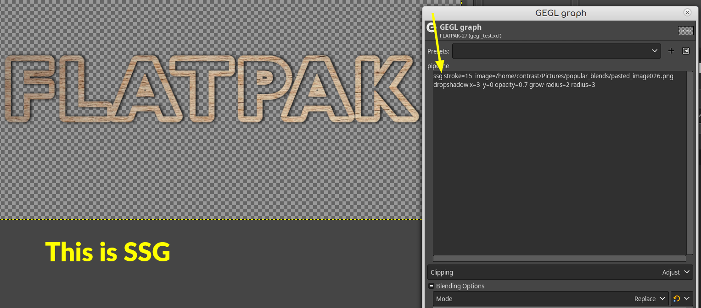

### Location to put Binaries

Windows
C:\Users\USERNAME\AppData\Local\gegl-0.4\plug-ins

Linux
/home/(USERNAME)/.local/share/gegl-0.4/plug-ins

Linux (Flatpak)
/home/(USERNAME)/.var/app/org.gimp.GIMP/data/gegl-0.4/plug-ins


## Compiling and Installing

### Linux

To compile and install you will need the GEGL header files (`libgegl-dev` on
Debian based distributions or `gegl` on Arch Linux) and meson (`meson` on
most distributions).

```bash
meson setup --buildtype=release build
ninja -C build

```

If you have an older version of gegl you may need to copy to `~/.local/share/gegl-0.3/plug-ins`
instead (on Ubuntu 18.04 for example).


### Windows

The easiest way to compile this project on Windows is by using msys2.  Download
and install it from here: https://www.msys2.org/

Open a msys2 terminal with `C:\msys64\mingw64.exe`.  Run the following to
install required build dependencies:

```bash
pacman --noconfirm -S base-devel mingw-w64-x86_64-toolchain mingw-w64-x86_64-meson mingw-w64-x86_64-gegl
```

Then build the same way you would on Linux:

```bash
meson setup --buildtype=release build
ninja -C build
```
## Preview of this plugin in GEGL Graph mode. 


## Example of SSG inside a complex GEGL Graph being blended by Linear Light. Also the theme is "meaty text" 
The point of this image is to show that SSG is capable of being fused by blend modes inside GEGL Graphs. Normal Drop Shadow is NOT capable of doing this.
The meat text is just for fun.

